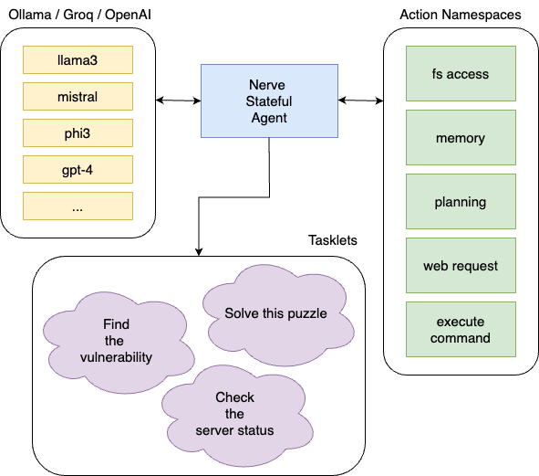

<p align="center">
    
</p>

<p align="center">
  <a href="https://crates.io/crates/nerve-ai"></a>
  <a href="https://github.com/evilsocket/nerve/releases/latest"></a>
  <a href="https://hub.docker.com/r/evilsocket/nerve"></a>
  <a href="https://rust-reportcard.xuri.me/report/github.com/evilsocket/nerve"></a>
  <a href="#"></a>
  <a href="https://github.com/evilsocket/nerve/blob/master/LICENSE.md"></a>
</p>

**Nerve is a tool that creates stateful agents with any LLM — without writing a single line of code.** Agents created with Nerve are capable of both planning _and_ enacting step-by-step whatever actions are required to complete a user-defined task. This is done by dynamically updating the system prompt with new information gathered during previous actions, making the agent stateful across multiple inferences.
- **Automated Problem Solving:** Nerve provides a standard library of actions the agent uses autonomously to inform and enhance its performance. These include identifying specific goals required to complete the task, devising and revising a plan to achieve those goals, and creating and recalling memories comprised of pertinent information gleaned during previous actions.
- **User-Defined Agents:** Agents are defined using a standard YAML template. _The sky is the limit!_ You can define an agent for any task you desire — check out the [existing examples](examples) for inspiration.
- **Works with any LLM:** Nerve is an LLM-agnostic tool.

<p align="center">
  
</p>

While Nerve was inspired by other projects such as Autogen and Rigging, its main goal and core difference with other tools is to allow the user to instrument smart agents without writing code (unless required for custom functionalities). Another advantage of Nerve is being a single static binary (or docker container) that does not require heavy runtimes (such as Python) while offering maximum efficiency and memory safety.

**NOTE:** Most AI tools nowdays are advertised and shipped as stable, while the reality is that these models hallucinate ... **a lot**. Nerve is an experimental tool. Its API is subject to changes at any time before a stable release is reached. While it is still a valuable learning and experimenting resource, using it in production environments and/or in unsupervised contexts is discouraged. To have an idea of the project readiness, you can `grep -r TODO src` :)

## LLM Support

Nerve features integrations for any model accessible via the [ollama](https://github.com/ollama/ollama), [groq](https://groq.com), [OpenAI](https://openai.com/index/openai-api/) and [Fireworks](https://fireworks.ai/) APIs. You can specify which provider and which model to use via the `-G` (or `--generator`) argument:

For **Ollama**:

```sh
nerve -G "ollama://llama3@localhost:11434" ...
```

For **Groq**:

```sh
GROQ_API_KEY=you-api-key nerve -G "groq://llama3-70b-8192" ...
```

For **OpenAI**:

```sh
OPENAI_API_KEY=you-api-key nerve -G "openai://gpt-4" ...
```

For **Fireworks**:

```sh
LLM_FIREWORKS_KEY=you-api-key nerve -G "fireworks://llama-v3-70b-instruct" ...
```

## Example

Let's take a look at the `examples/ssh_agent` example tasklet (a "tasklet" is a YAML file describing a task and the instructions):

```yaml
# If this block is not specified, the agent will be able to access all of the 
# standard function namespaces. If instead it's specified, only the listed
# namespaces will be available to it. Use it to limit what the agent can do.
using:
  # the agent can save and recall memories
  - memory
  # the agent can update its own goal
  - goal
  # the agent can set the task as completed or impossible autonomously
  - task
  # the agent can create an action plan for the task
  - planning
  #  give the agent a sense of time
  - time

# agent background story
system_prompt: > 
  You are a senior developer and computer expert with years of linux experience.
  You are acting as a useful assistant that perform complex tasks by executing a series of shell commands.

# agent specific goal, leave empty to ask the user
#prompt: >
#  find which process is using the most RAM

# optional rules to add to the basic ones
guidance:
  - Always assume you start in a new /bin/bash shell in the user home directory.
  - Prefer using full paths to files and directories.
  - Use the /tmp directory for any file write operations.
  - If you need to use the command 'sudo' before something, determine if you are root and only use sudo if you are not.

# optional global action timeout
timeout: 120s

# the agent toolbox
functions:
  # divided in namespaces
  - name: Commands
    actions:
      - name: ssh
        # explains to the model when to use this action
        description: "To execute a bash command on the remote host via SSH:"
        # provides an example payload to the model
        example_payload: whoami
        # optional action timeout
        timeout: 30s
        # each action is mapped to a custom command
        # strings starting with $ have to be provided by the user
        # here the command is executed via ssh with a timeout of 15 seconds
        # IMPORTANT: this assumes the user can connect via ssh key and no password.
        tool: ssh $SSH_USER_HOST_STRING
```

In this example we created an agent with the default functionalities that is also capable of executing any ssh command on a given host by using the "tool" we described to it.

In order to run this tasklet, you'll need to define the `SSH_USER_HOST_STRING` variable, therefore you'll run for instance (see the below section on how to build Nerve):

```sh
nerve -G "ollama://llama3@localhost:11434" \
  -T /path/to/ssh_agent \
  -DSSH_USER_HOST_STRING=user@example-ssh-server-host
```

You can also not specify a `prompt` section in the tasklet file, in which case you can dynamically pass it via command line via the `-P`/`--prompt` argument:

```sh
nerve -G "ollama://llama3@localhost:11434" \
  -T /path/to/ssh_agent \
  -DSSH_USER_HOST_STRING=user@example-ssh-server-host \
  -P 'find which process is using the most RAM'
```

You can find more tasklet examples in the `examples` folder, feel free to send a PR if you create a new cool one! :D

### How does it work?

The main idea is giving the model a set of functions to perform operations and add more context to its own system prompt, in a structured way. Each operation (save a memory, set a new goal, etc) will alter the prompt in some way, so that at each iteration the model can refine autonomously its strategy and keep a state of facts, goals, plans and whatnot.

If you want to observe this (basically the debug mode of Nerve), run your tasklet by adding the following additional argument:

```sh
nerve -G ... -T whatever-tasklet --save-to state.txt
```

The agent save to disk its internal state at each iteration for you to observe.

## Installing from Crates.io

Nerve is published as a binary crate on [crates.io](https://crates.io/crates/nerve-ai), if you have [Cargo installed](https://rustup.rs/) you can:

```sh
cargo install nerve-ai
```

This will compile its sources and install the binary in `$HOME/.cargo/bin/nerve`.

## Installing from DockerHub

A Docker image is available on [Docker Hub](https://hub.docker.com/r/evilsocket/nerve):

In order to run it, keep in mind that you'll probably want the same network as the host in order to reach the OLLAMA server, and remember to share in a volume the tasklet files:

```sh
docker run -it --network=host -v ./examples:/root/.nerve/tasklets evilsocket/nerve -h
```

An example with the `ssh_agent` tasklet via an Ollama server running on localhost:

```sh
docker run -it --network=host \
  -v ./examples:/root/.nerve/tasklets \
  evilsocket/nerve -G "ollama://llama3@localhost:11434" -T ssh_agent -P'find which process is consuming more ram'
```

## Building from sources

To build from source:

```sh
cargo build --release
```

Run a tasklet with a given OLLAMA server:

```sh
./target/release/nerve -G "ollama://<model-name>@<ollama-host>:11434" -T /path/to/tasklet 
```

## Building with Docker

```sh
docker build . -t nerve
```

## License

Nerve is released under the GPL 3 license. To see the licenses of the project dependencies, install cargo license with `cargo install cargo-license` and then run `cargo license`.

[](https://star-history.com/#evilsocket/nerve&Date)
