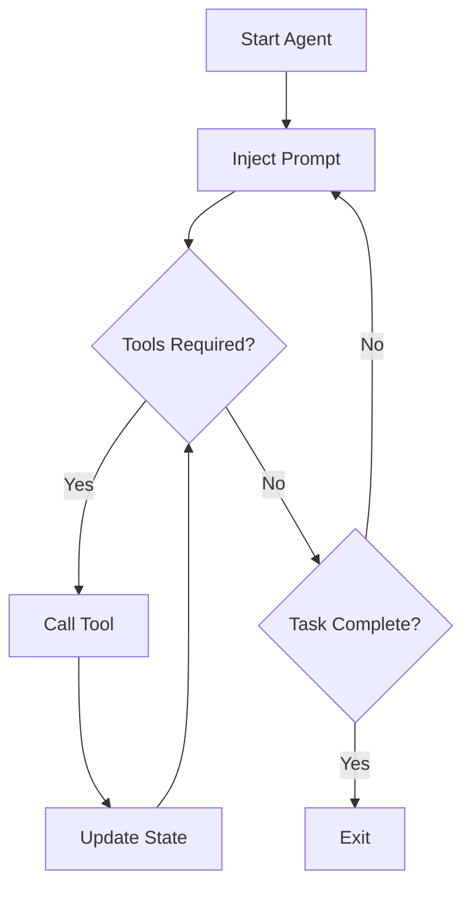

## Concepts

### What is Nerve?
Nerve is an **Agent Development Kit (ADK)** designed to let you build intelligent agents using Large Language Models (LLMs) with minimal effort. It provides a declarative YAML-based syntax, powerful CLI tools, and optional integration with the Model Context Protocol (MCP).

Nerve is designed for developers and cybersecurity professionals who:
- Are comfortable with the terminal, Python, and Git.
- Are curious about LLMs but don’t want to build everything from scratch.
- Want to create programmable agents rather than chatbots.

### Agent
An **agent** is a YAML file that defines:
- The agent's "role" (system prompt)
- A task (objective or behavior)
- The tools it can use (e.g., shell commands, HTTP requests, Python functions)

Agents run in a loop, invoking tools and modifying state until they complete or fail their task.

```yaml
agent: You are a cybersecurity assistant.
task: Scan the system for open ports.
using:
  - shell
```

#### Agent Configuration Fields

- **`agent`**: The system prompt defining the agent's role
- **`task`**: The objective or behavior (can use Jinja2 templating)
- **`generator`**: Override the default LLM model
- **`reasoning`**: Enable reasoning for supported models (`low`, `medium`, or `high`)
- **`description`**: Human-readable description of the agent
- **`version`**: Version string for your agent
- **`requires`**: Minimum Nerve version requirement (e.g., `">=1.2.0"`)
- **`defaults`**: Pre-set values for variables that can be overridden via CLI
- **`limits`**: Execution constraints:
  - `max_steps`: Maximum number of steps
  - `max_cost`: Maximum cost in USD
  - `timeout`: Timeout in seconds
- **`jail`**: Restrict namespace access to specific filesystem paths
- **`using`**: List of built-in namespaces to import
- **`mcp`**: MCP server configurations
- **`tools`**: Custom tool definitions

#### Enable Reasoning

For models supporting reasoning, you can add a `reasoning` field to enable it, with a value that can either be `low`, `medium` or `high`.

### Prompt Interpolation and Variables
Nerve supports [Jinja2](https://jinja.palletsprojects.com/) templating for dynamic prompt construction. You can:
- Inject command line arguments (`{{ target }}`)
- Use tool outputs (`{{ get_logs_tool() }}`)
- Include external files (``)
- Reference built-in variables like `{{ CURRENT_DATE }}` or `{{ LOCAL_IP }}`

### Tools
Tools extend the agent's capabilities. They can be:
- **Shell commands** (interpolated into a shell script)
- **Python functions** (via annotated `tools.py` files)
- **Remote tools via MCP** (from another Nerve instance or a compatible server)

Tools must be documented with a description and arguments:
```yaml
tools:
  - name: get_weather
    description: Get weather info for a city.
    arguments:
      - name: city
        description: Name of the city.
        example: Rome
    tool: curl wttr.in/{{ city }}
```

#### Tool Configuration Properties

Tools can have additional properties:
```yaml
tools:
  - name: process_data
    description: Process the input data
    complete_task: true  # Marks task as complete when this tool returns
    print: true  # Print tool output to console  
    mime: "application/json"  # Specify output format
    arguments:
      - name: data
        description: Input data
    tool: |  # For shell-based tools, the command template
      echo "Processing: {{ data }}"
```

#### Auto-loading Tools
If a `tools.py` file exists in the agent's directory, it's automatically loaded without needing to specify it in the YAML configuration.

#### Tools in Templates
You can call tools directly from Jinja2 templates in prompts:
```yaml
task: |
  Process this data: {{ get_data_tool() }}
  And analyze the results.
```

### Workflows
A **workflow** is a YAML file that chains multiple agents sequentially. Each agent in the pipeline can:
- Use a different model
- Receive input from the previous agent
- Define its own tools and prompt

This is useful for simple **linear pipelines** — for example:
```yaml
actors:
  step1: { generator: openai://gpt-4o }
  step2: { generator: anthropic://claude }
```
Each agent is executed in order, with shared state passed between them. Read more about [workflows in the specific page](workflows.md).

> For more complex orchestrations (e.g., branching logic, sub-agents, delegation), it's better to use **Nerve as an MCP server**. This way, agents can expose themselves as tools to a primary orchestrator agent. Refer to the [MCP documentation](mcp.md).

### Evaluation
Nerve supports **agent evaluation** with test cases to validate correctness, track regressions, or benchmark models.
You define input cases (via YAML, Parquet, or folders), and Nerve runs the agent against them.

```bash
nerve eval path/to/evaluation --output results.json
```

Read more in the [dedicated page](evaluation.md).

### MCP (Model Context Protocol)
Nerve can:
- **Use MCP tools**: connect to external memory, filesystem, or custom tool servers
- **Expose agents as MCP servers**: let other agents call them as tools

```yaml
mcp:
  memory:
    command: npx
    args: ["-y", "@modelcontextprotocol/server-memory"]
```

Read more in the [dedicated page](mcp.md).

### Diagram: Nerve Agent Execution (simplified)



This loop continues until the task is complete, failed, or times out.
